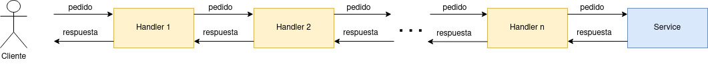

# A simple wrapper for hyper
##### Rhodium allows to create hyper servers as a stack of Handlers. 
Each Handler has its own `handle_request` and `handle_response` methods.
Handlers are executed by order while handling a request, and by the reverse order while handling the response.
The order in which `handle_request` and `handle_response` functions are executed is summarized in the next flow diagram:



Every Handler is a struct implementing de `RhodHandler` trait, while the Service is a struct implementing the `RhodService` trait.

**RhodHandlers + RhodService conforms a RhodStack**

To use Rhodium, you just have to create a `RhodStack`, set the socket address where the hyper server will listen,
and the protocol to be used (HTTP).

If the Handler i returns an error while handling a request:
     `catch_request` functions are called for the next handlers (Handler i+1, i+2, ..., n), and then the flow is ended.
     
If the `Service` returns an error:
     the flow is ended
If the `Handler i` returns an error while handling a response:
     `catch_response` functions are called for the next handlers (Handler i-1, i-2, ..., 1), and then the flow is ended.
     
## Testing
```
cargo test
```